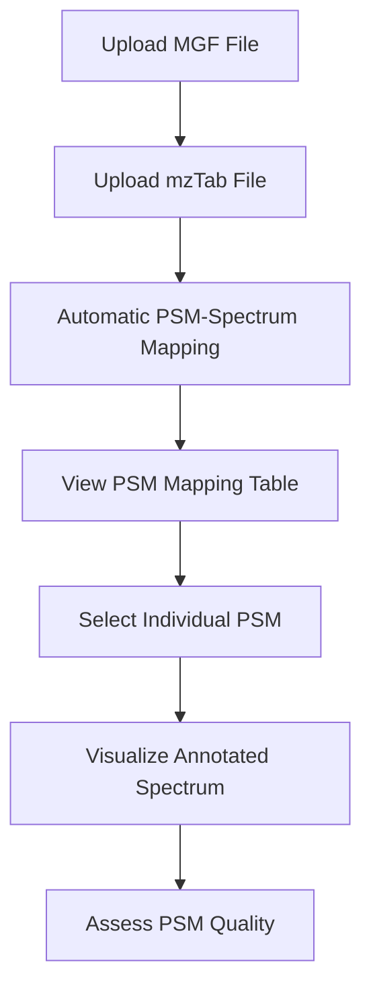

# PSM Viewer: Peptide-Spectrum Match Visualization Tool

<p align="center">
  
  
  
</p>

A comprehensive web-based application for visualizing and analyzing **Peptide-Spectrum Matches (PSMs)** from mass spectrometry proteomics experiments. Built with Streamlit, this interactive tool enables researchers to explore the quality and characteristics of peptide identifications through intuitive spectrum visualization.

## 🌟 Key Features

### 📊 **Interactive PSM Visualization**
- **Upload & Parse**: Support for standard mass spectrometry data formats (MGF spectra and mzTab identifications)
- **Intelligent Mapping**: Automatic matching of peptide identifications to their corresponding mass spectra using flexible reference matching
- **Quality Assessment**: Visual inspection of PSM quality through annotated spectrum plots
- **Real-time Interaction**: Web-based interface for immediate data exploration and analysis

### 🔬 **Scientific Visualization**
- **Fragment Ion Annotation**: Automatic labeling of b-ion and y-ion fragments with theoretical masses
- **Spectrum Preprocessing**: Intelligent peak filtering, intensity normalization, and precursor peak removal
- **Publication-Ready Plots**: High-quality matplotlib-based visualizations suitable for research reports
- **Mass Range Optimization**: Automatic m/z range selection focusing on peptide fragment regions

### 🖥️ **User-Friendly Interface**
- **Drag-and-Drop Upload**: Simple file upload for MGF and mzTab files
- **Interactive Tables**: Sortable, filterable PSM lists with key identification metrics
- **Spectrum Selection**: Click-to-view individual spectra with peptide sequence annotations
- **No Installation Required**: Runs in any modern web browser

## 🚀 Installation

### Prerequisites
- **Python 3.7** or higher
- **pip** package manager
- Web browser (Chrome, Firefox, Safari, or Edge)

### Quick Setup
1. **Clone the repository:**
   ```bash
   git clone https://github.com/erayfirat/PSMViewer1.git
   cd PSMViewer1
   ```

2. **Create a virtual environment:**
   ```bash
   # On macOS/Linux
   python3 -m venv venv
   source venv/bin/activate

   # On Windows
   python -m venv venv
   venv\Scripts\activate
   ```

3. **Install dependencies:**
   ```bash
   pip install -r requirements.txt
   ```

### 🔧 Required Dependencies

| Package | Version | Purpose |
|---------|---------|---------|
| **streamlit** | ≥1.0 | Web application framework |
| **pyteomics** | ≥4.0 | Mass spectrometry file parsing |
| **spectrum-utils** | ≥0.4 | Advanced spectrum processing & annotation |
| **matplotlib** | ≥3.5 | Publication-quality plotting |
| **pandas** | ≥1.3 | Data manipulation & analysis |
| **numpy** | ≥1.20 | Numerical computations |
| **pytest** | ≥7.0 | Unit testing framework |

## 📖 Usage Guide

### Getting Started

1. **Launch the application:**
   ```bash
   streamlit run app.py
   ```

2. **Open your browser:**
   - Navigate to `http://localhost:8501`
   - The PSM Viewer interface will load automatically

### Workflow Overview



### Step-by-Step Usage

#### 1. **File Upload**
- **MGF File**: Contains experimental mass spectra (collision-induced dissociation fragmentation patterns)
- **mzTab File**: Contains peptide search results from database search engines (Mascot, MaxQuant, Comet, etc.)

#### 2. **Data Processing**
- **Automatic Parsing**: Both files are parsed and loaded into structured data formats
- **Smart Matching**: PSMs are mapped to spectra using:
  - Direct spectrum title matching
  - Numeric index extraction from spectrum references
  - Support for various reference formats (`index=123`, `scan=456`, `spectrum:789`)

#### 3. **Results Visualization**
- **Summary Statistics**: Overview of loaded spectra, PSMs, and successful matches
- **Interactive Table**: Browse PSMs with filtering and sorting capabilities
- **Spectrum Plots**: Annotated mass spectra showing:
  - Experimental peaks (raw data)
  - Theoretical fragment ions (b-ions: N-terminal fragments, y-ions: C-terminal fragments)
  - Precursor ion m/z (parent peptide mass)

### Understanding the Output

#### PSM Mapping Table
| Column | Description |
|--------|-------------|
| **psm_index** | Original PSM row number |
| **sequence** | Identified peptide amino acid sequence |
| **matched_title** | Associated spectrum identifier |
| **spectra_ref** | Original spectrum reference from mzTab |

#### Spectrum Visualization
- **X-axis**: Mass-to-charge ratio (m/z) in Daltons
- **Y-axis**: Relative intensity (normalized)
- **Red annotations**: Detected b-ion fragments
- **Blue annotations**: Detected y-ion fragments
- **Mass tolerance**: 10 ppm for fragment matching

## 📋 Supported Data Formats

### 🔬 **MGF (Mascot Generic Format)**
```plaintext
BEGIN IONS
TITLE=Sample_001.123.123.2
PEPMASS=500.256 12345.6
CHARGE=2+
123.456 789.012
234.567 456.789
...
END IONS
```
- **Mass spectra** containing m/z values and intensities
- **Precursor information** (parent ion mass and charge)
- **Spectrum metadata** (titles, scan numbers, etc.)

### 📄 **mzTab Format**
Tab-separated proteomics results format supporting:
- **PSM section**: Peptide-spectrum matches with:
  - Peptide sequences
  - Spectrum references
  - Search engine scores
  - Protein assignments
  - Modification information

### 🔍 **Spectrum Reference Formats**
The application handles various spectrum referencing conventions:
- `index=42` (numeric index)
- `scan=123` (scan number)
- `spectrum:789` (colon-separated)
- `42` (plain numeric)

## 🧪 Testing

The PSM Viewer includes comprehensive unit and integration tests to ensure reliability and correctness of the data processing pipeline.

### Test Structure

```
tests/
├── __init__.py                 # Test module initialization
├── conftest.py                 # Shared pytest fixtures and configuration
├── test_load_mgf.py           # Unit tests for MGF file loading
├── test_load_mztab.py         # Unit tests for mzTab file loading
├── test_extract_index_from_spectra_ref.py  # Unit tests for spectrum reference parsing
├── test_map_psms_to_spectra.py  # Unit tests for PSM-spectrum mapping
└── test_integration.py        # Integration tests for full pipeline
```

### Test Coverage

The test suite covers:
- **Unit Tests** (28 tests): Individual function testing for core components
- **Integration Tests** (9 tests): End-to-end pipeline validation
- **Edge Cases**: Malformed input handling, missing data, error conditions
- **Data Formats**: Various spectrum reference formats and file structure variations

### Running Tests

1. **Install test dependencies** (included in `requirements.txt`):
   ```bash
   pip install -r requirements.txt
   ```

2. **Run all tests:**
   ```bash
   pytest tests/
   ```

3. **Run with verbose output:**
   ```bash
   pytest tests/ -v
   ```

4. **Run specific test file:**
   ```bash
   pytest tests/test_load_mgf.py
   ```

5. **Run tests with coverage:**
   ```bash
   pytest tests/ --cov=app --cov-report=html
   ```

### Key Test Areas

#### **MGF File Loading (`test_load_mgf.py`)**
- ✅ Valid MGF parsing with complete spectrum data
- ✅ Handling missing spectrum titles or PEPMASS fields
- ✅ Empty spectrum processing
- ✅ Multiple spectra in single file
- ✅ Error handling for malformed or invalid data

#### **mzTab File Loading (`test_load_mztab.py`)**
- ✅ Standard mzTab PSM section parsing
- ✅ Modified peptide sequences
- ✅ Multiple PSM entries
- ✅ Required PSM_ID column validation

#### **Spectrum Reference Parsing (`test_extract_index_from_spectra_ref.py`)**
- ✅ `index=123` format extraction
- ✅ `scan=456` format extraction
- ✅ `:789` suffix format
- ✅ Plain numeric references
- ✅ Edge cases and error conditions

#### **PSM-Spectrum Mapping (`test_map_psms_to_spectra.py`)**
- ✅ Direct title-based matching
- ✅ Index-based matching with various formats
- ✅ Title precedence over index
- ✅ No-match scenarios
- ✅ Mixed matching strategies

#### **Integration Tests (`test_integration.py`)**
- ✅ Full pipeline: MGF → mzTab → mapping → visualization
- ✅ Edge cases: empty files, mismatched references
- ✅ Error propagation and handling

### Test Data

Tests use sample data files in the `data/` directory:
- `sample_preprocessed_spectra.mgf`: Real mass spectrometry data
- `casanovo_20251029091517.mztab`: Peptide identification results


## ❓ Troubleshooting

### Common Issues

#### **No spectra match found**
- **Cause**: Spectrum references in mzTab don't match MGF titles/indices
- **Solution**: Check reference format consistency between files

#### **Empty spectrum plots**
- **Cause**: Missing precursor information or malformed data
- **Solution**: Verify MGF file contains proper PEPMASS fields

#### **Import errors**
- **Cause**: Missing dependencies or Python version incompatibility
- **Solution**: Install from `requirements.txt` and ensure Python 3.7+

#### **Memory issues with large files**
- **Cause**: Very large proteomics datasets
- **Solution**: Process data in smaller batches or increase system memory

### Performance Tips
- **File size**: Optimized for datasets up to 10,000 spectra/PSMs
- **Browser**: Use Chrome/Firefox for best performance
- **Network**: Local deployment recommended for large files

## 📄 License

This project is licensed under the **MIT License** - see the [LICENSE](LICENSE) file for details.

## 📚 References

### Scientific Background
- **Mass Spectrometry Basics**: Understanding peptide fragmentation patterns
- **Proteomics Standards**: HUPO mzTab format specifications
- **PSM Validation**: Best practices for visual spectrum inspection

### Technical Resources
- [Streamlit Documentation](https://docs.streamlit.io/)
- [Pyteomics Library](https://pyteomics.readthedocs.io/)
- [Spectrum-Utils](https://spectrum-utils.readthedocs.io/)
- [HUPO mzTab 2.0](https://hupo-psi.github.io/mzTab/)

---

*For questions, issues, or contributions, please open an issue on GitHub.*
